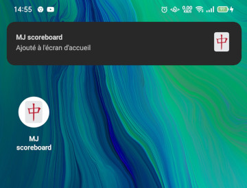

# Aide feuille de score MCR

Cette application sert à calculer automatiquement les points d'une partie de Mahjong avec les règles MCR.

Cette application est optimisée pour fonctionner sur mobile afin de noter rapidement des scores.

Cette application se limite aux parties :

- à 4 joueurs
- suivant les règles MCR avec 8 points de minimum
- sans pénalité

Pour une expérience optimale, il est recommandé d'installer en tant qu'application mobile.

## Utilisation de l'application

### Vue d'ensemble de l'interface

La vue est composée :

- d'une zone de saisie du nom des joueurs - en rouge
- de la table des scores - en vert
- d'une zone de saisie de la manche en cours - en bleu
- d'une zone d'actions diverses - en marron

### Saisie du nom des joueurs

Le nom des quatre joueurs est nécessaire pour procéder à la saisie des points.

### Saisie des points

Les différents modes de saisie possibles sont :

- gain d'une manche par un joueur sur la défausse d'un autre joueur
- gain d'une manche par un joueur sur tirage de tuile soi-même
- partie nulle

Le bouton + n'apparaît que lorsque la saisie est complète et valide.  
Cliquer sur ce bouton + pour valider la manche et l'ajouter au tableau des points.

### Correction d'une manche

Lorsqu'une manche est enregistrée, il est possible de la ré-éditer pour effectuer une correction.

Pour cela il faut cliquer sur la ligne à corriger dans le tableau de score.

La ligne devient surlignée et il est possible de changer toutes les caractéristiques de la manche.  
Cliquer sur la disquette pour enregistrer.

### Nouvelle partie

A la fin d'une partie, ou même durant une partie inachevée il est possible de faire une nouvelle partie.

Cliquer sur le bouton "Nouvelle partie" et valider pour abandonner la partie en cours.

## Installer en tant qu'application mobile

Il est possible d'installer cette application en tant qu'application mobile à part sur Android, iOS ou même PC.

Ceci est possible grâce à la technologie PWA (Progressive Web Application) disponible sur les navigateurs modernes. Cette installation ne passe pas par Google Store d'Android ou Play Store d'iOS.

Outre la possibilité de retrouver rapidement l'application, le principal avantage est de pouvoir utiliser l'application en mode hors ligne. Si l'application est démarrée avec une connexion internet disponible et qu'une mise à jour est disponible sur https://anhvut.github.io/mj-scoreboard, l'application est alors automatiquement mise à jour.

L'affichage veut varier suivant le modèle de mobile et le navigateur. Le site peut proposer d'installer l'application dans un bandeau ou bien dans le menu contextuel 3 points verticaux.

Après validation, l'application est disponible sur l'écran d'accueil du mobile.

## Rapport de bug, suggestion d'amélioration

Pour toute remarque sur l'application, veuillez créer une "issue" ou même "pull-request" sur https://github.com/anhvut/mj-scoreboard

## Licence

Cette application est sous licence MIT. Cela signifie que vous êtes libre d'étudier le code source, modifier, redistribuer.

Par contre, vous utilisez l'application telle qu'elle sans garantie. L'auteur ne pourrait être tenu responsable de tout dysfonctionnement.
L'application n'est pas conçue pour avantager un joueur en particulier !
